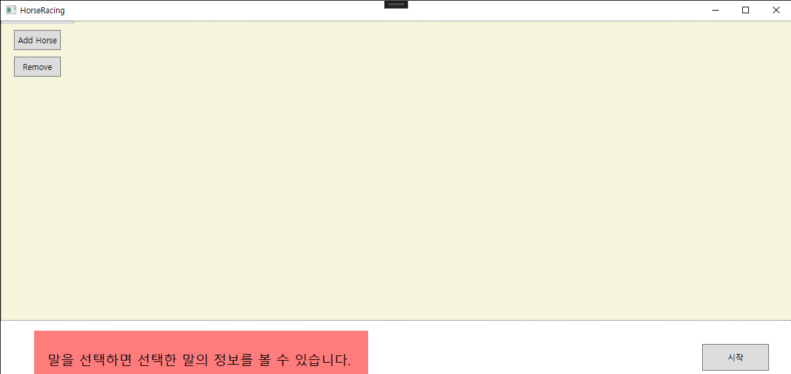
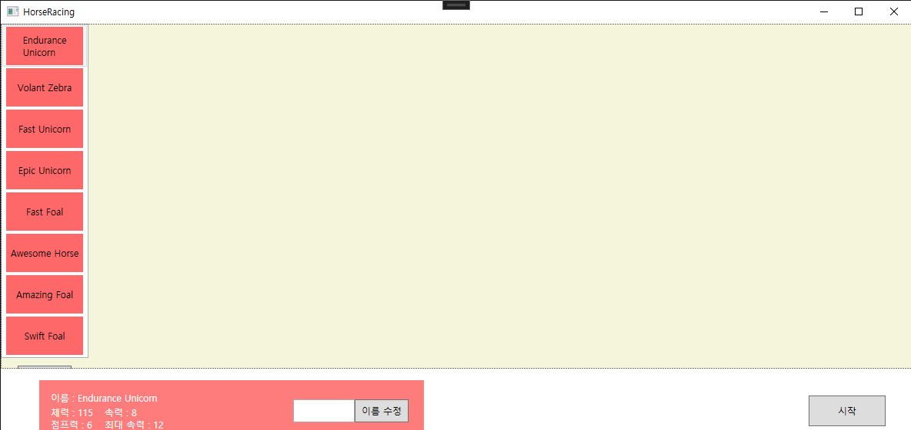
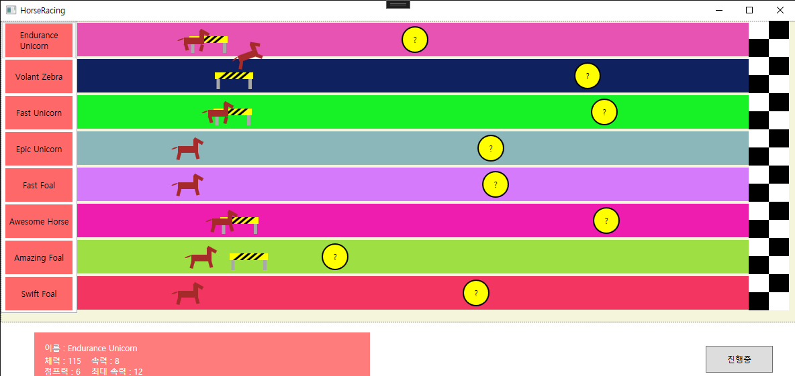
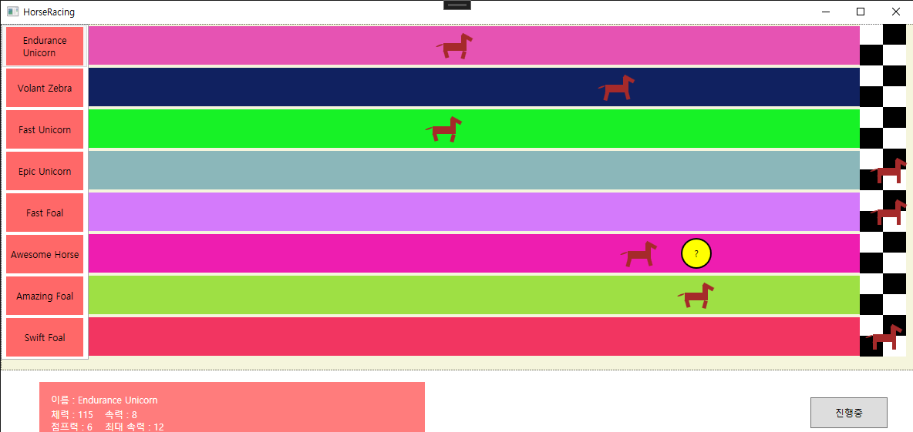
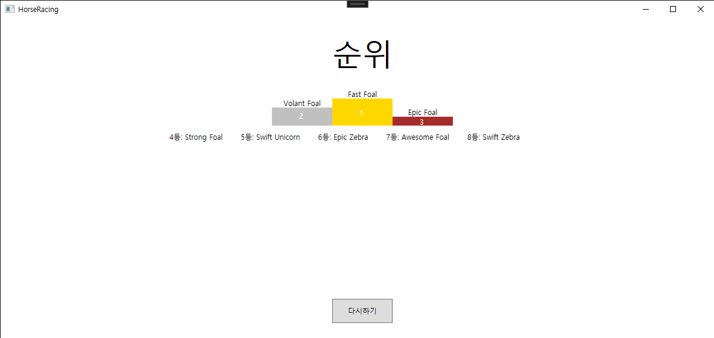

# Horse Racing
1. 프로젝트 개요  
OJT 실습 기간에 만든 윈도우 프로그램 경마게임입니다.  
랜덤 아이템과 장해물 기능이 있습니다.  
2. 개발 기간  
2023-11-23 ~ 2023-12월-15일  
3. 사용한 스킬  
C#, WPF  
4. 리뷰  
처음 이 과제를 받았을 땐 OJT 기간이 끝나기 전에 과연 만들 수 있을까 싶었지만   
막상 해보니 의외로 쉬웠고 퀄리티를 포기하여 기간 안에 완성할 수 있었습니다.  
5. 어떤 점이 부족하고 개선점  
   1. 요구분석과 설계를 하는 능력이 부족한 것 같습니다.  
   2. 퀄리티를 포기해서 어쩔 수 없지만 달릴때 다리 움직임이 부자연스러움.
   3. 말이 달리는 기능을 timer를 사용해 0.1초 지날 때 마다 margin을 증가시켜서   
   이동하는 것을 구현했는데 이동 하는게 부드럽지 않고 뚝뚝 끊기기 때문에   
animation을 공부해 달리는 기능을 animation으로 개선하면 좋을 것 같습니다.  
## 실행화면 이미지
* 실행화면1   
왼쪽의 버튼을 클리해 말을 생성, 삭제 할 수 있다. 
* 실행화면2   
생성한 말을 클릭하면 왼쪽 아래에 말의 스탯이 보여진다. 이름 수정도 가능 
* 실행화면3   
장해물에 막히면 3초동안 못움직임. 일정 확률로 장해물을 뛰어넘음 
* 실행화면4   
노란색 동그라미가 아이템. 종류는 질주, 거꾸로 달림, 순간이동 
* 실행화면5   
마지막 말이 결승선에 도달하면 순위 페이지로 넘어간다. 